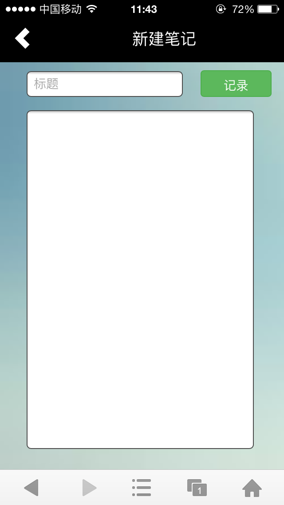
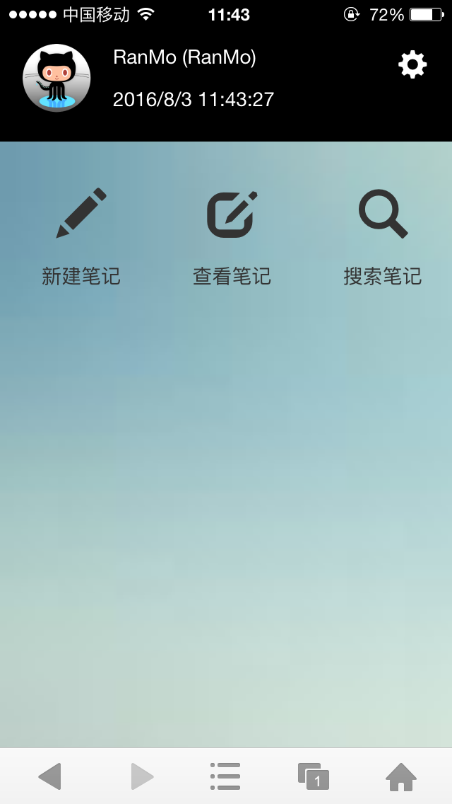
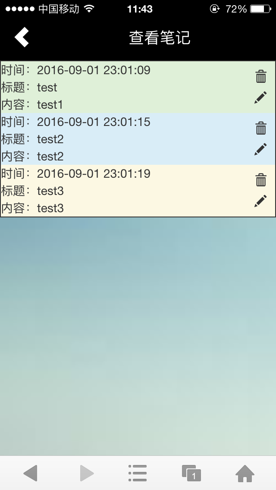
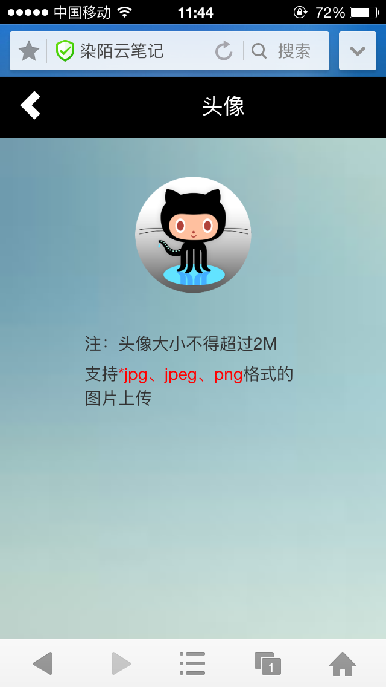
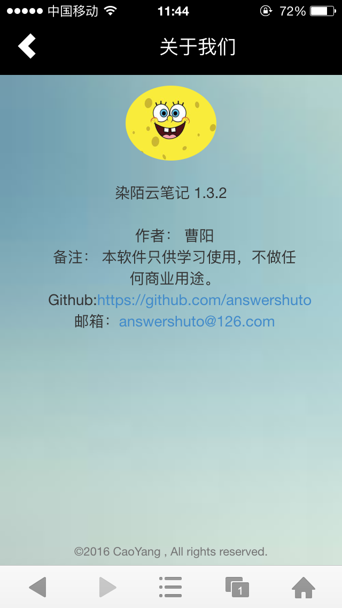

# Note based on React with flux

## 运行

		cd /Note

		node bin/www 
		
		cd /Note/views
		
		npm start
		
## 简介

染陌云笔记，后端采用Node.js，前端采用React,ui采用bootstrap响应式布局，数据库mongodb。

上图。

>   

>  

>  

>  

>  

>  

>  

>  

>  

>  

